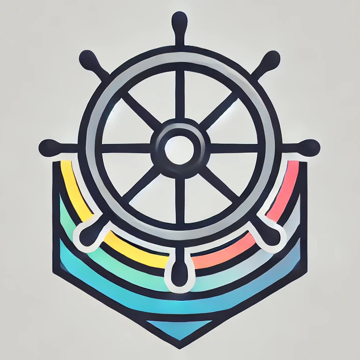

# Bifröst

Bifröst helps you federate your ServiceAccounts to get Secret-less
access to resources from cloud providers by leveraging the Kubernetes
built-in OpenID Connect (OIDC) functionality.

The project has two main goals:

* Provide Kubernetes users with an infrastructure component that can securely
  provide applications with temporary access tokens for resources on cloud
  providers without requiring any Secrets to be stored in the cluster.
* Provide Kubernetes ecosystem maintainers with a library for implementing the
  above functionality in their own Kubernetes API extensions i.e. in their own
  Custom Resources.
